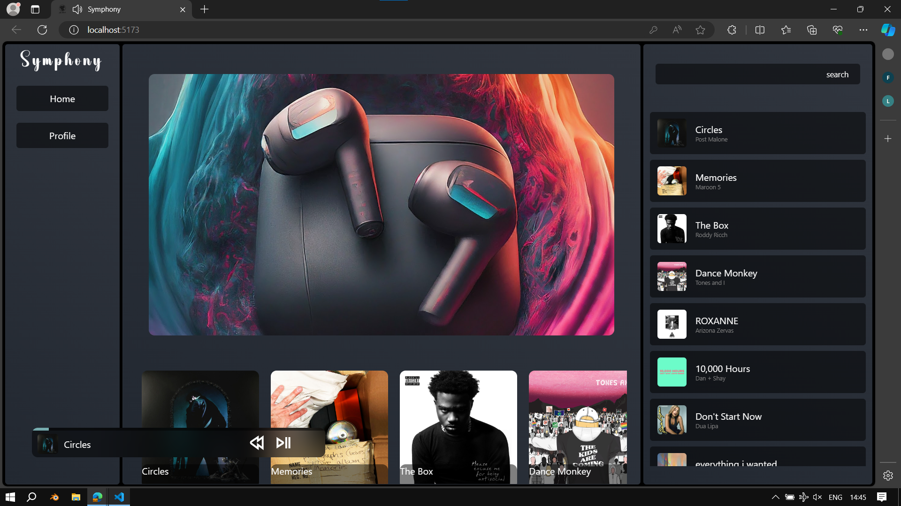
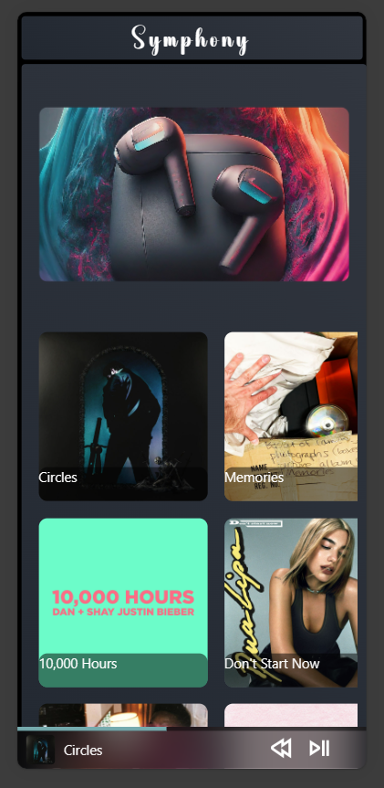
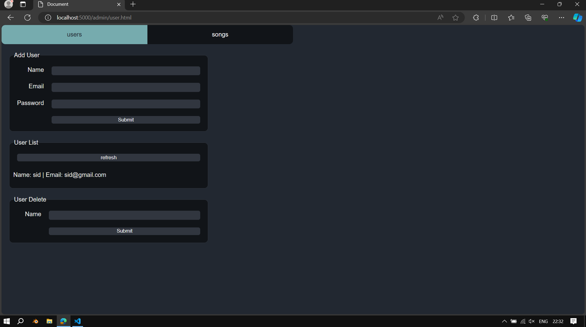
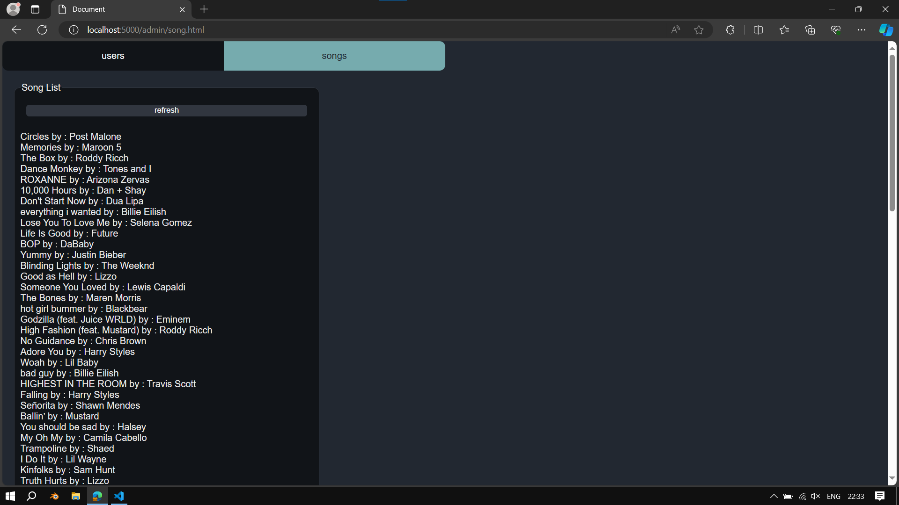

# Symphony

An Open Source music Streaming Platform

Frontend: Web App
---
# Desktop

# Mobile

Backend: Admin DashBoard
---

---

## Current Features:

Frontend:
- Song play, pause.
- Basic Song Fetch and Display on Home tab
- Basic Search. Can Search song name and artist name.
- Responsive

Backend:
- admin panel
- user add, remove and list
- song list

## Future Features

Frontend:
- Better layout for home page
- profile page
- settings tab
- recommendation system
- Better layout for mobile page

Backend:
- song add, song remove.
- saving and fetching songs from cloud storage